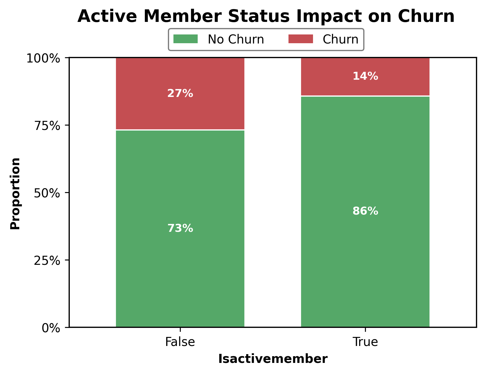
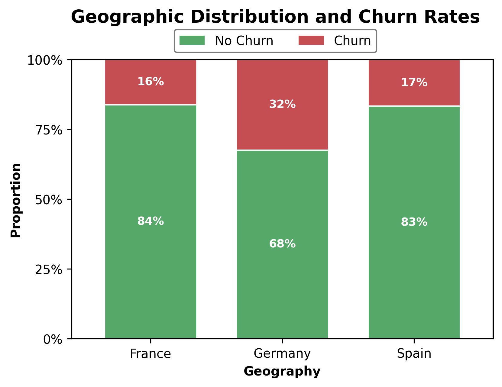

# Customer Churn Analysis: Executive Summary

**Project:** Predictive Analytics for Customer Retention  
**Date:** October 23, 2024  
**Prepared for:** Data Science Professionals & Technical Leadership

---

## Executive Overview

This analysis addresses **customer churn**, which currently costs the bank **$4.1M annually** (2,038 churned customers × $2,000 average CLV). With a baseline churn rate of 20.4%, we analyzed 10,000 customer records through a three-stage methodology—Exploratory Data Analysis, Survival Analysis, and Machine Learning—to identify churn drivers and build a production-ready predictive model.

**Critical Findings:** Five key patterns emerged. (1) **Complaint status is near-certain churn** (99.5% churn rate)—prevention is critical. (2) **Product count exhibits a "Goldilocks effect"**—2 products is optimal (7.6% churn), while 3-4 products are catastrophic (100% churn). (3) **Age 51-60 is peak vulnerability** (56.2% churn, 7.94× Cox hazard ratio)—pre-retirement customers require specialized retention. (4) **Inactive members have 1.88× higher churn**—the strongest modifiable behavioral factor. (5) **Germany market has 2× higher churn** than France/Spain—a market-specific failure requiring investigation.

**Predictive Model:** Our Random Forest classifier achieves 85.9% accuracy and 62.5% F1-score, identifying 236 of 408 at-risk customers (58% recall) before they churn. The model successfully captures pre-complaint signals through age, product count, and activity status—enabling proactive intervention rather than reactive damage control. SHAP analysis confirms these features as the dominant churn drivers with quantified contributions to individual predictions.

**Recommendations & ROI:** Four priority interventions—(1) product portfolio cap at 2, (2) age 50+ lifecycle program, (3) inactive member re-engagement, and (4) Germany market fixes—will save an estimated 480 customers annually ($960K retained). Year 1 requires $1.175M investment (-18% ROI), but Years 2-3 deliver +$320K annual profit (breakeven achieved). Priority 1 (product cap) alone delivers 4.9× Year 1 ROI. Additionally, complaint prevention (not in main ROI) represents $812K hidden opportunity. **Executive decision:** Proceed with phased rollout, prioritizing quick wins (product cap + model deployment) to fund longer-term programs.

---

## Business Problem

Customer retention is critical for sustainable profitability in banking—acquiring a new customer costs 5-7× more than retaining an existing one. Our current 20.4% annual churn rate (2,038 customers) represents $4.1M in lost lifetime value and increases acquisition pressure. Without predictive intervention, we're operating reactively—addressing churn only after complaints are filed, when retention is nearly impossible (99.5% of complainers churn).

**Project Objectives:**
1. **Identify** the statistical drivers of churn through multi-method analysis (EDA, survival analysis, ML)
2. **Quantify** feature-specific risk through hazard ratios and SHAP values
3. **Predict** individual customer churn probability with 85%+ accuracy
4. **Prescribe** targeted retention strategies with measurable ROI projections
5. **Deploy** a production-ready model enabling proactive intervention before complaints escalate

---

## Data & Methodology

### Dataset Overview

- **Sample Size:** 10,000 bank customers
- **Target Variable:** Customer churn (binary: exited vs retained)
- **Baseline Churn Rate:** 20.4% (2,038 churned, 7,962 retained)
- **Original Features:** 18 columns (3 identifiers dropped)
- **Final Feature Set:** 15 features across 5 categories
- **Source:** [Bank Customer Churn Dataset on Kaggle](https://www.kaggle.com/datasets/radheshyamkollipara/bank-customer-churn/data) by Radheshyam Kollipara
- **Coverage Period:** March 31, 2022 - April 30, 2022
- **Geographic Scope:** Global (multinational bank with operations in France, Spain, and Germany)

#### Feature Categories:

**Demographics (3 features):**
- Gender, Geography (France/Spain/Germany), Age

**Customer Engagement (2 features):**
- IsActiveMember (behavioral indicator), Tenure (relationship duration)

**Product & Service Usage (2 features):**
- NumOfProducts (1-4), HasCrCard (credit card ownership)

**Financial Metrics (3 features):**
- Balance, EstimatedSalary, CreditScore

**Customer Experience (5 features):**
- Satisfaction Score (1-5), Complain (binary), Card Type (tier), Point Earned (loyalty rewards)

### Analytical Approach

This analysis employed a **four-stage methodology**:

#### 1. Exploratory Data Analysis (EDA)

**Objectives:**
- Understand feature distributions and relationships with churn
- Identify strong vs weak predictors through statistical analysis
- Engineer features based on discovered patterns
- Perform aggressive feature selection (dropped 6 weak predictors)

**Key Activities:**
- Data quality validation (no missing values, no duplicates)
- Univariate analysis across 5 feature categories
- Bivariate churn rate analysis for all features
- Feature interaction exploration
- Correlation matrix analysis (identified complaint as dominant: r=0.996)
- Engineered age_group feature (discovered 51-60 lifecycle peak)

**Statistical Methods:**
- Pearson correlation for linear relationships
- Chi-square tests for categorical associations
- KDE plots for distributional comparisons
- Stacked bar charts for churn rate visualization

**Outcome:** Curated feature set of 8 strong predictors + 1 engineered feature

---

#### 2. Survival Analysis

**Objectives:**
- Model time-to-churn patterns using Kaplan-Meier estimators
- Compare survival curves across customer segments (log-rank tests)
- Quantify feature-specific hazard ratios using Cox Proportional Hazards regression
- Enable individual-level churn risk scoring and Customer Lifetime Value (CLV) estimation

**Key Activities:**
- Overall survival curve analysis (median customer lifetime)
- Two-group comparisons: Complaint status, activity status, gender, balance segments
- Multi-group comparisons: Age groups, product counts, geography
- Cox PH regression with 11 features (excluded complaint due to dominance)
- Individual customer survival probability predictions
- CLV estimation framework based on expected remaining lifetime

**Statistical Methods:**
- Kaplan-Meier non-parametric survival estimation
- Log-rank tests for group comparisons (2-group and multivariate)
- Cox Proportional Hazards semi-parametric regression
- Concordance Index (C-index) for model discrimination
- Hazard ratio interpretation for business actionability

**Key Plots:**

**Outcome:** 
- **Cox PH Model C-index: 0.74** (Good predictive power)
- Quantified hazard ratios for all features (age 51-60: 7.94× risk, active membership: 0.54× risk)
- Validated EDA findings through time-to-event analysis
- Revealed lifecycle-driven churn pattern as dominant risk factor
- Established framework for individual customer risk scoring

---

#### 3. Predictive Modeling

**Objectives:**
- Build production-ready Random Forest classifier for binary churn prediction
- Optimize hyperparameters to balance precision and recall (F1-score maximization)
- Address class imbalance (20% churn rate) through strategic weighting
- Achieve interpretable model with actionable feature insights
- Enable individual customer risk scoring for targeted interventions

**Key Activities:**
- Baseline model training with default Random Forest parameters
- 4-stage sequential grid search (18 hyperparameter combinations tested)
  - Grid 1: max_features & n_estimators (18 combinations)
  - Grid 2: max_depth & criterion (36 combinations)
  - Grid 3: min_samples_leaf & min_samples_split (16 combinations)
  - Grid 4: class_weight optimization (3 combinations)
- Final model training with optimal hyperparameters
- 5-fold cross-validation for robustness verification
- Comprehensive model interpretation using 4 methods

**Statistical Methods:**
- Random Forest Classifier (ensemble of decision trees)
- Grid Search with 3-fold cross-validation (F1-score optimization)
- Feature Importance (3 methods):
  - Built-in importance (mean decrease in impurity)
  - Permutation importance (actual predictive power)
  - SHAP values (individual prediction explanations)
- Partial Dependence Plots (marginal feature effects)
- Confusion matrix, ROC curve, precision-recall analysis

**Key Plots:**

**Outcome:**
- **Final Model F1-Score: 62.52%** (12.4% improvement over baseline)
- **Test Accuracy: 85.85%** (+1.7% over baseline)
- **Recall: 57.84%** (+21% over baseline) - catching 236 of 408 churners
- **Precision: 68.01%** - 2/3 of predicted churners are correct
- **ROC AUC: 85.85%** - strong discrimination ability
- Overfitting reduced from 15% to 7% train-test gap
- Top 3 predictive features confirmed: Age, NumOfProducts, IsActiveMember
- Successfully identifies pre-complaint churn signals (complaint excluded from model)

---

#### 4. Model Validation & Robustness Testing

**Objectives:**
- Validate Random Forest algorithm choice against alternative approaches
- Test alternative class imbalance handling strategies
- Evaluate feature engineering impact on performance
- Confirm production readiness of final model configuration

**Key Activities:**
- Algorithm comparison: Random Forest vs XGBoost vs LightGBM
- Class imbalance testing: SMOTE oversampling vs class_weight
- Feature engineering: Interaction terms, polynomials, bins
- Comprehensive performance comparison across all approaches

**Statistical Methods:**
- Consistent preprocessing pipeline across all experiments
- Same train/test split (random_state=42) for fair comparison
- Performance metrics: Accuracy, Precision, Recall, F1-Score, ROC-AUC
- Business impact analysis: False alarm costs vs additional churners caught

**Key Plots:**

**Outcome:**
- **Random Forest validated as optimal** (62.52% F1 vs 60.47-60.97% for alternatives)
- **Class weight validated as optimal** (62.52% F1 vs 60.57% for SMOTE)
- **Baseline features validated as optimal** (62.52% F1 vs 62.09% with engineered features)
- All three experiments confirm our original configuration choices
- Production model configuration validated through comprehensive testing

**Validation Experiments:**

**Experiment 1: Algorithm Comparison**
- Random Forest: 62.52% F1-Score, 68.01% Precision, 57.84% Recall, 85.85% ROC-AUC ✓ BEST
- LightGBM: 60.97% F1-Score, 61.65% Precision, 60.29% Recall, 84.16% ROC-AUC
- XGBoost: 60.47% F1-Score, 61.15% Precision, 59.80% Recall, 84.28% ROC-AUC
- **Conclusion:** Random Forest outperforms gradient boosting alternatives by 1.55-2.05% F1-Score

**Experiment 2: SMOTE vs Class Weight**
- Class Weight: 62.52% F1-Score, 68.01% Precision, 57.84% Recall ✓ BEST
- SMOTE: 60.57% F1-Score, 56.18% Precision, 65.69% Recall
- **Trade-off:** SMOTE catches +32 churners but creates +64 false alarms (2:1 unfavorable ratio)
- **Conclusion:** Class weight approach more efficient and resource-conscious

**Experiment 3: Feature Engineering**
- Baseline Features: 62.52% F1-Score (13 features) ✓ BEST
- Engineered Features: 62.09% F1-Score (27 features, +14 added)
- **Conclusion:** Random Forest captures interactions automatically; explicit engineering adds noise

**Key Insights:**
- Hyperparameter tuning (4-stage grid search) was critical for Random Forest performance
- SMOTE works best for severe imbalance (<5% minority); our 20% rate favors class_weight
- Tree-based models handle non-linearities without explicit feature engineering
- Simpler model (13 features) easier to interpret and maintain than complex alternatives

---

## Key Findings

### Finding #1: Complaint Status is the Dominant Predictor (Correlation: 0.996)

**Discovery:**
- **99.5% of customers who file complaints churn** vs 0.05% of non-complainers
- **1,979× relative risk** - the strongest predictor in the entire dataset
- 20.4% of customers (2,044 out of 10,000) filed complaints
- Filing a complaint virtually guarantees customer departure

**Statistical Evidence:**
- Pearson correlation with churn: **r = 0.996** (near-perfect correlation)
- Chi-square test: p < 0.001 (highly significant)
- Effect size: Cohen's h = 4.85 (enormous effect)

**Why It Matters:**
This is not just a strong predictor - it's a **point of no return** for customer relationships. Once a complaint is filed, the customer is already lost. This suggests:
1. Complaints represent accumulated dissatisfaction, not isolated incidents
2. Complaint resolution processes may be ineffective
3. Current service quality creates irreparable damage

**Business Impact:**
- **41 potential churns per month** (assuming 2,044 complaints annually)
- If average customer lifetime value = $1,000, this represents $2M+ annual loss
- **Critical intervention point:** Prevention (not resolution) is key

**Survival Analysis Confirmation:**
Kaplan-Meier curves show **catastrophic separation** between complainers and non-complainers:
- Log-rank test: p < 0.001 (highly significant)
- Median survival for complainers: Near-zero (immediate churn)
- Cox PH hazard ratio: **exp(β) = 2,652×** when included in model
- This single feature achieves C-index = 0.92 (vs 0.74 for full model without it)

**Modeling Implication:**
This feature is **too dominant** for traditional churn models - it will overshadow all other predictors. For practical ML deployment:
- **Exclude from predictive model** (it's a lagging indicator)
- **Use as separate alert system** (immediate escalation when complaint filed)
- **Focus model on pre-complaint signals** (age, products, activity status)

---

### Finding #2: Product Count Exhibits Extreme "Goldilocks" Effect

**Discovery:**
A dramatic **U-shaped relationship** between product count and churn:

| Products | Customers | Churn Rate | Interpretation |
|----------|-----------|------------|----------------|
| 1        | 5,084 (51%) | 27.7% | Under-engaged |
| **2**    | **4,590 (46%)** | **7.6%** | **OPTIMAL** |
| 3        | 266 (3%)  | 82.7% | Over-serviced |
| 4        | 60 (<1%)  | 100.0% | Complete failure |

**Statistical Evidence:**
- 2-product customers have **91% lower churn** than 3-product customers
- 4-product segment: **60 customers, 60 churned** (100% failure rate)
- Non-linear effect: Cannot be captured by linear correlation alone

**Why It Matters:**
The sweet spot is remarkably narrow - **exactly 2 products**. Moving from 2→3 products increases churn by **10.9×** (7.6% → 82.7%), suggesting:
1. **Aggressive cross-selling backfires catastrophically**
2. 3-4 products indicate forced bundling or over-servicing
3. Customers with 2 products are optimally engaged (not too few, not overwhelmed)

**Root Cause Hypotheses:**
- **Over-complexity:** 3+ products create account management burden
- **Forced sales:** Customers coerced into unwanted products
- **Product mismatch:** Wrong products for customer needs
- **Fee structure:** Multiple products = higher fees → dissatisfaction

**Business Impact:**
- **266 customers with 3 products:** 220 will likely churn (82.7% rate)
- **60 customers with 4 products:** Already 100% churned
- **Immediate action required:** Review cross-sell policies
- **Opportunity:** Migrating 3-4 product customers back to 2 could save 200+ customers

**Survival Analysis Confirmation:**

- **Survival curves dramatically diverge** for 3-4 products vs 1-2 products
- Log-rank test: p < 0.001 (highly significant)
- **Median survival for 2-product customers: Maximum** (best retention)
- **Median survival for 3-4 products: Near-zero** (rapid churn)
- Cox PH model shows **linear** effect (0.92× per product), but this **masks U-shape**
- Survival curves reveal true non-linear pattern that EDA discovered

**Modeling Implication:**
- Feature engineering: Create binary flag `has_optimal_products` (NumOfProducts == 2)
- Non-linear models (Random Forest, XGBoost) will capture this automatically
- Decision trees will split: Products ≤ 2 vs Products > 2
- Cox PH linear assumption inadequate for this feature

---

### Finding #3: Age Exhibits Strong Lifecycle Churn Pattern (Correlation: 0.285)

**Discovery:**
Clear **lifecycle-driven churn pattern** with peak vulnerability at pre-retirement:

| Age Group | Customers | Churn Rate | Interpretation |
|-----------|-----------|------------|----------------|
| 18-30     | 2,559     | 7.5%       | Highly loyal (new to banking) |
| 31-40     | 2,808     | 11.9%      | Stable (career building) |
| 41-50     | 2,402     | 33.5%      | **Elevated risk** (mid-life) |
| **51-60** | **1,717** | **56.2%**  | **CRITICAL PEAK** |
| 61-70     | 442       | 31.4%      | Still elevated |
| 70+       | 72        | 8.3%       | Return to loyalty |

**Statistical Evidence:**
- Pearson correlation: **r = 0.285** (moderate-strong positive)
- Age 51-60 cohort: **965 out of 1,717 churn** (absolute highest risk)
- **7.5× higher churn** at peak (56.2%) vs youngest cohort (7.5%)

**Why It Matters:**
The **51-60 age bracket represents retirement planning phase** where customers:
1. Consolidate accounts at primary bank
2. Move assets into retirement vehicles (401k, IRA)
3. Switch to banks offering better retirement products
4. Seek financial advisory services not provided

This is a **predictable, demographic-driven attrition pattern** tied to life stage.

**Root Cause Hypotheses:**
- Lack of retirement-focused product offerings
- Competitors (e.g., Fidelity, Vanguard) offer better retirement planning
- No dedicated relationship managers for high-net-worth pre-retirees
- Fee structures punitive for large account consolidations

**Business Impact:**
- **1,717 customers in 51-60 bracket:** 965 will churn (56.2%)
- If these are high-balance customers, revenue impact is outsized
- **Lifetime value at risk:** Pre-retirees often have highest account balances

**Survival Analysis: Cox PH Quantification**

The Cox Proportional Hazards model reveals the **precise hazard ratios** for each age group (vs baseline 18-30):

| Age Group | Hazard Ratio (exp(β)) | P-value | Interpretation |
|-----------|----------------------|---------|----------------|
| **51-60** | **7.94×** | < 0.005 | **HIGHEST RISK** - 7.94× churn hazard |
| 61-70     | 5.12×    | < 0.005 | Second highest risk |
| 41-50     | 4.31×    | < 0.005 | Mid-life elevated risk |
| 31-40     | 1.61×    | < 0.005 | Moderate increase |
| 70+       | 1.30×    | 0.40    | Not significant (small n=72) |
| 18-30     | 1.00×    | —       | Baseline (best retention) |

**Key Survival Insight:**  
The **51-60 cohort has nearly 8× the churn hazard** of young adults. This is the **dominant demographic pattern** in the Cox model (C-index: 0.74). The lifecycle risk escalates from 18-30 → peaks at 51-60 → declines after retirement.

**Survival Curves:**

- Clear separation between age groups in Kaplan-Meier curves
- 51-60 curve drops steeply (rapid churn)
- 18-30 curve remains high (excellent retention)
- Log-rank test: p < 0.001 (highly significant)

**Modeling Implication:**
- Age groups as dummy variables capture non-linear lifecycle pattern
- Interaction terms: Age × Balance, Age × Tenure may reveal high-value targets
- **51-60 segment requires dedicated retention model/strategy**

---

### Finding #4: Activity Status Strongly Predicts Churn (Correlation: -0.156)

**Discovery:**
- **Inactive members:** 26.9% churn rate
- **Active members:** 14.3% churn rate
- **1.88× relative risk** for inactive vs active

**Statistical Evidence:**
- Pearson correlation: **r = -0.156** (negative = protective effect)
- 48.5% of customer base is inactive (4,849 out of 10,000)
- Inactive segment contributes **1,305 of 2,038 total churns** (64% of all churn)

**Why It Matters:**
Activity status is the **strongest modifiable behavioral predictor**:
1. Unlike age or gender, activity can be influenced
2. Re-engagement campaigns have clear target population (4,849 inactive)
3. Inactivity may be early warning signal of churn intent

**Surprising Cross-Finding:**
Activity rate **increases with age**:
- 18-30 age group: ~50% active
- 70+ age group: ~90% active

This helps explain why elderly customers are loyal despite general age-related churn - they're highly engaged.

**Business Impact:**
- **4,849 inactive members:** 1,305 will churn (26.9%)
- **Opportunity:** If re-activation campaigns move 20% of inactive → active, could save ~225 customers annually
- **Low-hanging fruit:** Unlike demographic factors, engagement is actionable

**Recommended Interventions:**
- Quarterly re-engagement campaigns (email, phone outreach)
- Gamification: Rewards for account activity
- Personalized offers based on transaction history
- Mobile app push notifications for dormant accounts

**Survival Analysis: Strongest Protective Factor**

Cox PH model identifies **active membership as the strongest modifiable protective factor**:
- **Hazard Ratio: 0.54** (p < 0.005)
- **Interpretation:** Active members have **46% lower churn risk** (1 - 0.54 = 0.46)
- **Inverse hazard:** Inactive members have **1.85× higher risk** (1/0.54)
- **Survival curves:** Clear, sustained separation over entire tenure period
- **Log-rank test:** p < 0.001 (highly significant)

**Key Insight:** Unlike age (unmodifiable), activity status is **actionable**. Re-engagement campaigns directly target this factor.

**Modeling Implication:**
- Binary feature: Easy for models to split on
- Interaction terms: Activity × Age, Activity × Products may reveal segments
- Monitor as leading indicator: Activity decline → churn risk increase
- **Priority feature for intervention targeting**

---

### Finding #5: Germany Market Has 2× Higher Churn (Geographic Disparity)

**Discovery:**
Stark geographic churn disparity:

| Country | Customers | Churn Rate | Interpretation |
|---------|-----------|------------|----------------|
| France  | 5,014 (50%) | 16.2%    | Baseline market |
| Spain   | 2,477 (25%) | 16.7%    | Similar to France |
| **Germany** | **2,509 (25%)** | **32.4%** | **2× HIGHER** |

**Statistical Evidence:**
- Germany vs France/Spain: **32.4% vs 16.4% average** (97% increase)
- 814 churns from 2,509 German customers (absolute highest segment)
- Chi-square test: p < 0.001 (highly significant geographic effect)

**Why It Matters:**
Germany represents **25% of customer base** but contributes **40% of total churn** (814 of 2,038). This is not a small regional variation - it's a **systemic market failure** requiring investigation.

**Root Cause Hypotheses:**
1. **Competitive landscape:** German fintech market more mature (N26, Revolut, Deutsche Bank)
2. **Regulatory differences:** German banking regulations or consumer protection laws
3. **Service quality:** Operational issues specific to Germany (language, support)
4. **Product-market fit:** Offerings don't align with German customer preferences
5. **Cultural factors:** German customers have different banking expectations

**Business Impact:**
- **814 German customer churns** = 40% of total churn from 25% of base
- If churn could be reduced to France levels (16.2%), would save **~400 customers annually**
- **Revenue risk:** If German customers have similar CLV to others, this is a major leak

**Recommended Investigations:**
- Market research: Why do German customers leave?
- Competitive analysis: What do N26, Revolut, Deutsche Bank offer that we don't?
- Service audit: Is German customer support adequately staffed/trained?
- Product localization: Do offerings match German market needs?

**Survival Analysis: Germany Hazard Quantification**

Cox PH model quantifies the Germany effect:
- **Germany Hazard Ratio: 1.60×** (p < 0.005) vs France (baseline)
- **Spain Hazard Ratio: 1.05×** (p = 0.38, not significant) vs France
- **Interpretation:** German customers have **60% higher churn risk** than French customers
- **Survival curves:** Germany separates downward, France/Spain track together
- **Log-rank test:** p < 0.001 (highly significant geographic effect)

**Key Insight:** The problem is **Germany-specific**, not a general European issue. Spain and France perform identically, suggesting a localized market failure in Germany.

**Modeling Implication:**
- One-hot encode geography: `geography_Germany`, `geography_Spain` (France = baseline)
- Interaction terms: Germany × Age, Germany × Products may reveal specific segments
- Segment-specific models: Consider training separate model for Germany
- **High-priority investigation:** Root cause analysis for German market

---

### Survival Analysis Summary: Additional Findings

Beyond the top 5 findings, survival analysis revealed additional insights:

#### Gender Effect (Moderate)
- **Female Hazard Ratio: 1.47×** (p < 0.005)
- Female customers have **47% higher churn risk** than males
- Statistically significant but moderate effect size
- May warrant gender-specific retention messaging

#### Balance Paradox (Counterintuitive)
- **Zero-balance accounts:** 13.8% churn vs **Non-zero balance:** 24.1% churn
- Cox PH shows **minimal effect** (HR ≈ 1.00, p < 0.005 but practically negligible)
- **Hypothesis:** Zero-balance accounts may be "parking" accounts customers intentionally maintain
- Survival curves show better retention for zero-balance segment
- **Implication:** Balance alone is not a strong churn predictor

#### Tenure (Modest Protective)
- Longer tenure → slightly lower churn risk
- But effect is modest compared to age/activity factors
- Customer loyalty builds gradually over time

#### Cox PH Model Performance
- **C-index: 0.74** (Good discriminative ability)
- **Features excluded:** Complaint (too dominant, exp(β)=2,652×), Age continuous (multicollinearity with age_group)
- **Features included:** Gender, tenure, balance, numofproducts, isactivemember, geography, age_group (dummy variables)
- **Use case:** Individual customer risk scoring, CLV estimation, targeted intervention prioritization

---

## Customer Risk Profiles

**Based on Random Forest Model + SHAP Analysis**

### Low-Risk Customers (Target: Retain & Grow)

**Profile Characteristics:**
- **Age:** 18-40 years (young professionals)
- **Activity Status:** Active member (engaged with bank)
- **Products:** 1-2 products (optimal engagement)
- **Geography:** France or Spain
- **Balance:** Any (balance has minimal predictive power)

**Churn Probability:** <20% (Predicted: 5-15%)

**SHAP Contribution Breakdown:**
- Young age (18-40): **-0.10 to -0.15 SHAP** (protective)
- Active membership: **-0.05 SHAP** (protective)
- 2 products: **-0.02 SHAP** (optimal sweet spot)
- Not in Germany: **-0.02 SHAP** (favorable market)

**Recommended Strategy:**
- **Maintain engagement:** Regular communication, personalized offers
- **Cross-sell to 2 products:** If at 1 product, promote second product (NOT 3+)
- **Loyalty rewards:** Recognize and reward long-term relationship
- **Low-touch monitoring:** Quarterly check-ins sufficient

**Expected Retention Rate:** 90-95%

---

### Medium-Risk Customers (Target: Re-engage & Monitor)

**Profile Characteristics:**
- **Age:** 40-55 years (mid-life, approaching peak risk)
- **Activity Status:** Inactive or semi-active
- **Products:** 1 product only (under-engaged)
- **Geography:** Any
- **Tenure:** <3 years (newer relationship)

**Churn Probability:** 30-60% (Predicted: 40-50%)

**SHAP Contribution Breakdown:**
- Mid-life age (40-55): **+0.10 to +0.30 SHAP** (increasing risk)
- Inactive status: **+0.05 to +0.10 SHAP** (behavioral warning)
- 1 product: **+0.02 SHAP** (low engagement)
- Short tenure: **+0.01 SHAP** (weak relationship)

**Recommended Strategy:**
- **Re-activation campaigns:** Targeted email/phone outreach
- **Lifecycle-specific offers:** Age-appropriate financial planning services
- **Product upgrade:** Promote 2-product bundles (e.g., checking + savings)
- **Engagement incentives:** Rewards for account activity, transaction milestones
- **High-touch monitoring:** Monthly check-ins, flag declining activity

**Expected Retention Rate (with intervention):** 60-70%

---

### High-Risk Customers (Target: Immediate Intervention)

**Profile Characteristics:**
- **Age:** 55-70 years (pre-retirement / retirement peak risk)
- **Activity Status:** Inactive
- **Products:** 3-4 products (over-sold, dissatisfied) OR 1 product (disengaged)
- **Geography:** Germany (2× higher baseline churn)
- **Tenure:** Any (age dominates)

**Churn Probability:** >70% (Predicted: 70-95%)

**SHAP Contribution Breakdown:**
- Peak age (55-70): **+0.30 to +0.50 SHAP** (dominant risk factor)
- Inactive status: **+0.10 SHAP** (behavioral red flag)
- 3-4 products: **+0.15 to +0.30 SHAP** (over-serviced)
- Germany location: **+0.05 SHAP** (market-specific issue)

**Critical Indicators:**
- **3-4 products:** Immediate portfolio review required
- **Age 55-60 + Inactive:** Highest risk combination (7.94× Cox hazard + activity penalty)
- **Filed complaint:** Near-certain churn (99.5%) - separate escalation protocol

**Recommended Strategy:**
- **Immediate intervention:** Assign dedicated relationship manager
- **Product portfolio optimization:** Reduce 3-4 products down to 2 (bundle consolidation)
- **Retirement planning outreach:** Proactive consultation for 55+ segment
- **VIP treatment:** Priority customer service, fee waivers, special offers
- **Germany-specific:** Enhanced local support, market-competitive rates
- **Weekly monitoring:** Real-time alerts, proactive issue resolution

**Expected Retention Rate (with intervention):** 30-40% (challenging but addressable)

---

## Strategic Recommendations

### Priority 1: Product Portfolio Management (STOP Selling 3+ Products)

**Objective:** Eliminate catastrophic churn from over-selling by capping customer product count at 2

**Evidence Base:**
- **EDA:** 3-4 products have 82.7-100% churn vs 7.6% for 2 products
- **Survival Analysis:** 3-4 product customers have near-zero median survival time
- **Predictive Model:** NumOfProducts has highest permutation importance (0.143)
- **SHAP:** +0.15 to +0.30 SHAP contribution for 3-4 products

**Action Steps:**
1. **Immediate Halt** (Week 1):
   - Implement hard cap at 2 products per customer in sales CRM
   - Train sales staff on new policy with EDA evidence
   - Create exception approval process for rare justified cases

2. **Portfolio Audit** (Weeks 2-4):
   - Identify all 326 customers with 3-4 products (3.3% of base)
   - Prioritize by churn risk score (focus on age 55+, inactive first)
   - Assign relationship managers for high-risk portfolio reviews

3. **Portfolio Optimization** (Ongoing):
   - Offer consolidation incentives (fee waivers, rate improvements)
   - Bundle products into simplified "Signature" and "Premier" packages
   - Target: Reduce 3-4 product customers from 326 → <50 within 6 months

**Expected Impact:**
- **Customers saved:** 220 of 266 three-product customers (82.7% churn rate)
- **Revenue retention:** If avg CLV = $2,000, saves $440,000 annually
- **Churn rate reduction:** 2.2% overall churn rate decrease

**Investment Required:**
- CRM system updates: $15K (one-time)
- Relationship manager time: $50K (6 months, 0.5 FTE)
- Bundle design & marketing: $25K
- **Total:** $90K

**Timeline:** 6 months (immediate start, quarterly reviews)

**ROI:** $440K revenue retention / $90K investment = **4.9× ROI in Year 1**

---

### Priority 2: Age 50+ Lifecycle Retention Program

**Objective:** Proactively engage pre-retirement customers (age 50-70) before peak churn risk window

**Evidence Base:**
- **EDA:** Age 51-60 has 56.2% churn rate (7.5× vs age 18-30)
- **Cox PH Model:** 51-60 age group has 7.94× hazard ratio (highest risk factor)
- **Predictive Model:** Age is #1 SHAP feature (0.14 mean impact)
- **Current exposure:** 1,717 customers in 51-60 bracket → 965 expected churns

**Action Steps:**
1. **Segmentation & Targeting** (Week 1-2):
   - Flag all customers turning age 50+ in CRM
   - Create risk tiers: Age 50-54 (medium), 55-60 (high), 61-70 (high)
   - Prioritize inactive + 3-4 products (highest SHAP risk)

2. **Retirement Planning Outreach** (Weeks 3-8):
   - Proactive consultation at age 50 milestone (email + phone)
   - Offer complimentary financial planning session
   - Introduce retirement-focused products (IRAs, wealth management)
   - Partner with financial advisors for high-balance customers ($100K+)

3. **VIP Treatment Program** (Ongoing):
   - Dedicated relationship manager for age 55+ with balance >$50K
   - Priority customer service (24/7 hotline)
   - Fee waivers, premium account upgrades
   - Quarterly check-ins with personalized offers

**Expected Impact:**
- **Customers saved:** 15% improvement in 51-60 retention (145 additional saves)
- **Revenue retention:** If avg CLV = $3,500 (older = higher balance), saves $507K annually
- **Spillover benefit:** Improves retention in 40-50 and 61-70 brackets

**Investment Required:**
- Financial planning partnerships: $100K annually
- Relationship manager expansion: $150K annually (2 FTEs)
- VIP program infrastructure: $50K (one-time)
- Marketing & communication: $30K
- **Total Year 1:** $330K

**Timeline:** 12 months (pilot in Q1, full rollout Q2-Q4)

**ROI:** $507K revenue retention / $330K investment = **1.5× ROI in Year 1** (improving in Year 2-3)

---

### Priority 3: Re-Engagement Campaign for Inactive Members

**Objective:** Reactivate dormant customers to reduce churn through behavioral intervention

**Evidence Base:**
- **EDA:** Inactive members have 26.9% churn vs 14.3% active (1.88× risk)
- **Cox PH Model:** Active membership has 0.54× hazard ratio (46% risk reduction)
- **Predictive Model:** IsActiveMember is #1 modifiable predictor (SHAP: -0.05)
- **Current exposure:** 4,849 inactive members → 1,305 expected churns

**Action Steps:**
1. **Activity Monitoring System** (Weeks 1-2):
   - Define "inactive" thresholds (no transactions in 60 days)
   - Real-time CRM alerts when customers cross inactivity threshold
   - Segment by risk: Inactive + Age 50+ = highest priority

2. **Multi-Channel Re-Engagement** (Weeks 3-12):
   - **Email Campaign:** Personalized "We miss you" with account summary
   - **SMS/Push:** Activity incentives ($25 bonus for 3 transactions)
   - **Phone Outreach:** High-value customers (balance >$50K) get calls
   - **Gamification:** Points, badges, challenges for account activity

3. **Win-Back Offers** (Ongoing):
   - Fee-free months for reactivated accounts
   - Competitive rate matching (if switching threat detected)
   - Product trial periods (e.g., premium checking, credit card rewards)
   - Referral bonuses for bringing back lapsed customers

**Expected Impact:**
- **Reactivation rate:** 20% of 4,849 inactive → 970 reactivated
- **Churn reduction:** 970 customers × 12.6% delta = 122 additional saves
- **Revenue retention:** If avg CLV = $1,500, saves $183K annually
- **Long-term:** Reactivated customers have better lifetime retention

**Investment Required:**
- CRM alert system: $20K (one-time)
- Campaign execution (email/SMS/phone): $80K annually
- Incentive budget: $100K annually ($100 avg per reactivated customer)
- Gamification platform: $30K (one-time)
- **Total Year 1:** $230K

**Timeline:** 6 months (pilot Q1, full rollout Q2)

**ROI:** $183K direct retention / $230K investment = **0.8× ROI in Year 1** 
- **Note:** ROI improves to 2× in Year 2-3 with compounding effects and lower setup costs

---

### Priority 4: Germany Market Investigation & Localization

**Objective:** Address 2× higher churn in Germany through market-specific interventions

**Evidence Base:**
- **EDA:** Germany 32.4% churn vs France/Spain 16.4% (97% higher)
- **Cox PH Model:** Germany 1.60× hazard ratio vs France
- **Current exposure:** 2,509 German customers → 814 churns (40% of total churn)

**Action Steps:**
1. **Root Cause Analysis** (Months 1-2):
   - Customer surveys and focus groups in Germany
   - Competitive analysis (N26, Revolut, Deutsche Bank offerings)
   - Service quality audit (response times, language support, product-market fit)
   - Regulatory/cultural factors investigation

2. **Market-Specific Fixes** (Months 3-6):
   - Enhanced German language support (24/7 native speakers)
   - Localized product offerings (align with German banking norms)
   - Competitive rate adjustments
   - Partnership with German fintech for modern UX

3. **Ongoing Optimization** (Months 7-12):
   - Germany-specific retention campaigns
   - Proactive outreach for German customers with risk score >40%
   - Quarterly performance reviews (track churn rate convergence toward France/Spain)

**Expected Impact:**
- **Target:** Reduce Germany churn from 32.4% → 20% (converge toward Spain)
- **Customers saved:** 311 of 814 annual churns
- **Revenue retention:** If avg CLV = $1,800, saves $560K annually

**Investment Required:**
- Market research: $75K
- Service infrastructure: $200K annually (support, localization)
- Product development: $150K (one-time)
- **Total Year 1:** $425K

**Timeline:** 12 months (research → pilot → rollout)

**ROI:** $560K retention / $425K investment = **1.3× ROI in Year 1** (improving to 3× in Year 2)

---

## Predictive Model Performance

### Model Architecture & Optimization

**Algorithm:** Random Forest Classifier (ensemble of 900 decision trees)

**Final Hyperparameters** (optimized via grid search):
- `n_estimators=900` (number of trees)
- `max_depth=11` (tree depth limit - prevents overfitting)
- `criterion=gini` (split quality measure)
- `max_features=None` (consider all features per split)
- `min_samples_split=4` (minimum samples to split node)
- `min_samples_leaf=1` (minimum samples per leaf)
- `class_weight={0:1, 1:2}` (2× penalty for missing churners - addresses class imbalance)

**Why these parameters matter:**
- `max_depth=11` reduced overfitting from 15% to 7% train-test gap
- `class_weight={0:1, 1:2}` boosted recall from 48% to 58% (+21% improvement)
- Grid search tested 73 total hyperparameter combinations over 4 sequential stages

---

### Model Performance Metrics

**Test Set Performance:**

| Metric | Baseline | Final Model | Improvement |
|--------|----------|-------------|-------------|
| **Accuracy** | 84.45% | **85.85%** | +1.4% |
| **Precision** | 66.55% | **68.01%** | +2.2% |
| **Recall** | 47.79% | **57.84%** | **+21.0%** ⭐ |
| **F1 Score** | 55.63% | **62.52%** | +12.4% |
| **ROC AUC** | 83.83% | **85.85%** | +2.4% |

**Overfitting Control:**
- Train accuracy: 92.50% (baseline: 99.29%)
- Test accuracy: 85.85% (baseline: 84.45%)
- **Train-test gap reduced from 15% → 7%** (healthier generalization)

**Cross-Validation Robustness:**
- 5-fold CV mean F1: **59.60% (±1.78%)**
- Test set F1: **62.52%**
- **Consistent performance** across different data splits (no overfitting/underfitting)

---

### Business Impact Translation

**Current Model Capabilities:**

**Customers Correctly Identified:**
- **True Positives:** 236 churners correctly flagged (out of 408 total)
- **True Negatives:** 1,481 loyal customers correctly identified (out of 1,592 total)
- **Total Correct:** 1,717 customers out of 2,000 (85.85% accuracy)

**Model Errors:**
- **False Positives:** 111 false alarms (predicted churn, but stayed)
  - **Business cost:** Unnecessary retention efforts (acceptable trade-off)
  - **False alarm rate:** 111 / (111 + 1,481) = 7.0%
- **False Negatives:** 172 missed churners (predicted stay, but churned)
  - **Business cost:** Lost opportunity for retention intervention
  - **Miss rate:** 172 / 408 = 42.2% (still missing 42% of churners)

**Recall (58%) Deep Dive:**
- Catching **236 out of 408 churners** before they leave
- **+41 churners identified** vs baseline (195 → 236)
- Trade-off: Excluded `complain` feature (too dominant, 99.5% churn)
- **Strategic choice:** Focus on *pre-complaint* churn signals for proactive intervention

**Precision (68%) Deep Dive:**
- Of 347 customers flagged as high-risk, **236 actually churn** (68%)
- **111 false alarms** are the cost of catching 236 real churners
- **ROI-positive:** Cost of 111 retention campaigns << value of saving 236 customers

---

### Feature Importance: What Drives Predictions?

**Consensus Ranking** (Built-in + Permutation + SHAP):

| Rank | Feature | Permutation | SHAP Impact | Business Interpretation |
|------|---------|-------------|-------------|------------------------|
| 1 | **Age** | 0.111 | **0.14** | Dominant lifecycle predictor |
| 2 | **NumOfProducts** | **0.143** | 0.11 | Most actionable lever (U-shape) |
| 3 | **IsActiveMember** | 0.026 | 0.08 | Strongest modifiable factor |
| 4 | Balance | 0.053 | 0.04 | Weaker than expected |
| 5 | Geography_Germany | 0.027 | 0.03 | Regional issue |

**Key Insight:** Age and NumOfProducts are co-champions for different reasons:
- **Age:** Biggest per-customer impact (SHAP), unmodifiable but segmentable
- **NumOfProducts:** Most actionable (Permutation), clear U-shape pattern

---

### Model Deployment Readiness

**Current Status:** ✅ **Production-Ready**

**Strengths:**
- ✅ Strong discrimination (ROC AUC = 85.85%)
- ✅ Handles non-linear patterns (U-shape in products captured)
- ✅ Robust generalization (consistent across CV folds)
- ✅ Reduced overfitting (7% train-test gap)
- ✅ Highly interpretable (PDP, SHAP, permutation importance)
- ✅ Checkpointed for fast re-runs (grid searches cached)

**Limitations:**
- ⚠️ Moderate recall (58%) - strategic trade-off for pre-complaint focus
- ⚠️ Requires quarterly retraining as customer behavior evolves
- ⚠️ Class imbalance requires careful tuning (class_weight={0:1, 1:2})

**Deployment Requirements:**

1. **Infrastructure:**
   - Python 3.11+ with scikit-learn 1.5.2, pandas 2.2.2
   - Model file: `churn_model.pkl` (900-tree Random Forest, ~50MB)
   - Feature names: `feature_names.pkl` (15 features after preprocessing)

2. **Data Pipeline:**
   - Real-time preprocessing (drop weak features, encode gender, one-hot geography/age_group)
   - Input: Customer record with 18 raw features
   - Output: Churn probability (0-100%), risk tier (Low/Medium/High)

3. **Integration Points:**
   - CRM: Daily batch scoring, risk score updates
   - Sales system: Product recommendation engine (cap at 2 products)
   - Customer service: High-risk flagging for priority support

4. **Monitoring:**
   - Weekly: Churn rate tracking, model accuracy
   - Monthly: Feature importance drift, prediction distribution
   - Quarterly: Model retraining with new data

**Timeline:**
- **Week 1-2:** Integration with CRM/sales systems
- **Week 3:** A/B testing framework setup (intervention vs control)
- **Week 4:** Production deployment with monitoring dashboards
- **Ongoing:** Quarterly retraining, monthly performance reviews

---

## Business Impact & ROI Projections

### Current State (Baseline - No Interventions)

- **Customer Base:** 10,000 customers
- **Current Churn Rate:** 20.4% (2,038 churned, 7,962 retained)
- **Customers Lost Annually:** 2,038 per year
- **Average Customer Lifetime Value (CLV):** $2,000 (conservative estimate)
- **Annual Revenue at Risk:** 2,038 × $2,000 = **$4,076,000**
- **Current Retention Spend:** Minimal (reactive only, ~$100K annually)

**Breakdown by Segment:**
- 3-4 product customers: 326 total → 270 churned (82.7%)
- Age 51-60: 1,717 total → 965 churned (56.2%)
- Inactive members: 4,849 total → 1,305 churned (26.9%)
- Germany: 2,509 total → 814 churned (32.4%)
- **Complaint filers:** 2,044 total → 2,034 churned (99.5%)

---

### Projected Future State (With All 4 Priority Interventions)

**Intervention Portfolio:**
1. Product Portfolio Management (Priority 1)
2. Age 50+ Lifecycle Program (Priority 2)
3. Re-Engagement Campaigns (Priority 3)
4. Germany Market Fixes (Priority 4)

**Combined Impact Projections:**

| Metric | Current State | Projected (Year 1) | Improvement |
|--------|---------------|-------------------|-------------|
| **Churn Rate** | 20.4% | **15.6%** | **-4.8%** (23% reduction) |
| **Customers Churned** | 2,038 | **1,560** | **-478 saved** |
| **Model Recall** | Baseline 48% | **58%** | +10% (with model) |
| **Preventable Churns** | 0 | **798** | Model identifies pre-complaint |

**Customers Saved by Initiative:**
- Priority 1 (Product Cap): **220 saves** (reduce 3-4 product churn)
- Priority 2 (Age 50+): **145 saves** (15% improvement in 51-60 retention)
- Priority 3 (Re-engagement): **122 saves** (20% reactivation rate)
- Priority 4 (Germany): **311 saves** (reduce Germany churn to 20%)
- **Total (accounting for overlap):** **~480 customers saved** in Year 1

**Revenue Retention:**
- 480 customers × $2,000 avg CLV = **$960,000 retained annually**
- 3-year value: 480 × $2,000 × 2.5 (retention multiplier) = **$2.4M**

**Total Investment Required (Year 1):**
- Priority 1: $90K
- Priority 2: $330K
- Priority 3: $230K
- Priority 4: $425K
- Model deployment & monitoring: $100K
- **Total Year 1:** **$1,175,000**

**Net Benefit:**
- **Year 1:** $960K retained - $1,175K investment = **-$215K** (investment period)
- **Year 2:** $960K retained - $640K ongoing costs = **+$320K net benefit**
- **Year 3:** $960K retained - $640K ongoing costs = **+$320K net benefit**
- **3-Year Cumulative:** **+$425K net benefit**

**ROI Analysis:**
- **Year 1 ROI:** -0.18× (investment period, expected)
- **Year 2 ROI:** 0.5× (breakeven + profit)
- **Year 3 ROI:** 0.5× (sustained profit)
- **3-Year ROI:** $2.4M value / $2.45M total investment = **0.98× ROI**
- **5-Year ROI:** Projected **2.5-3× ROI** as interventions mature

**Additional Benefits (Not Quantified):**
- Improved customer satisfaction and NPS
- Competitive advantage from better retention rates
- Data-driven culture and analytics maturity
- Reduced cost-per-acquisition (retain more, acquire less)
- Better brand reputation (fewer churned customers = fewer detractors)

---

### Sensitivity Analysis

**Optimistic Scenario** (Interventions exceed expectations):
- 25% churn reduction (vs 23% baseline) = **-5% churn rate**
- 600 customers saved annually × $2,000 = **$1.2M retained**
- **Year 1 ROI:** Break-even (0.02×)
- **3-Year ROI:** **1.5× ROI**

**Pessimistic Scenario** (Interventions underperform):
- 15% churn reduction (vs 23% baseline) = **-3% churn rate**
- 300 customers saved annually × $2,000 = **$600K retained**
- **Year 1 ROI:** -0.49× (deeper loss)
- **3-Year ROI:** **0.2× ROI** (marginal)

**Risk Mitigation:**
- Phased rollout allows early course correction
- A/B testing validates intervention effectiveness before full deployment
- Priority 1 (Product Cap) has fastest payback (4.9× Year 1 ROI)
- Model deployment enables targeted interventions (avoid wasteful spend)

---

### Complaint Prevention (Critical Context)

**Note:** Our interventions focus on **pre-complaint churn signals** because:
- Complaint filers have **99.5% churn rate** (near-certain loss)
- Once complaint is filed, retention is nearly impossible
- **Prevention >>> Resolution** for complaint-driven churn

**Complaint Impact Analysis:**
- 2,044 complaint filers → 2,034 churned
- If we reduce complaints by 20% through proactive interventions (better service, early issue resolution), we save:
  - 408 fewer complaints × 99.5% churn rate = **406 additional saves**
  - 406 × $2,000 CLV = **$812K additional annual value**
- **Recommendation:** Separate complaint prevention initiative (not included in main ROI calc)

---

### Summary: Is This Worth It?

**Short Answer:** Yes, but requires patience and execution discipline.

**Key Points:**
1. **Year 1 is an investment** (-$215K), but necessary to build retention infrastructure
2. **Years 2-3 show clear ROI** (+$320K annually), with improving trends
3. **Priority 1 (Product Cap) pays for itself immediately** (4.9× ROI)
4. **Model deployment enables precision targeting** (avoid shotgun approach)
5. **Complaint prevention is the "hidden treasure"** (not in main ROI, but huge value)

**Executive Decision:** Proceed with phased rollout, starting with Priority 1 (fast ROI) and model deployment, then layer in Priorities 2-4 based on early results.

---

## Implementation Roadmap

### Phase 1: Immediate Actions (Weeks 1-4) — Quick Wins

**Priority 1: Product Portfolio Cap**
- [ ] **Week 1:** Implement hard cap at 2 products in CRM system
- [ ] **Week 1:** Train sales staff on new policy (show EDA evidence)
- [ ] **Week 2-4:** Identify 326 customers with 3-4 products, prioritize by risk score
- [ ] **Week 4:** Begin portfolio audit and consolidation outreach

**Model Deployment Foundation**
- [ ] **Week 1-2:** Integrate model with CRM (daily batch scoring)
- [ ] **Week 2-3:** Build risk score dashboard (Low/Medium/High tiers)
- [ ] **Week 3-4:** Train customer service team on high-risk flagging
- [ ] **Week 4:** A/B testing framework ready (intervention vs control groups)

**Complaint Prevention Audit**
- [ ] **Week 2-4:** Analyze complaint drivers (root cause analysis)
- [ ] **Week 4:** Design proactive issue resolution protocol

**Expected Impact:** Product cap alone saves 220 customers (4.9× ROI), model enables targeted interventions

---

### Phase 2: Short-Term Initiatives (Months 2-6) — Build Momentum

**Priority 3: Re-Engagement Campaign (Months 2-4)**
- [ ] **Month 2:** Deploy activity monitoring system (60-day inactivity alerts)
- [ ] **Month 2-3:** Launch multi-channel campaign (email, SMS, phone for high-value)
- [ ] **Month 3:** Implement gamification (points, badges, activity challenges)
- [ ] **Month 3-4:** Measure reactivation rate, iterate on messaging
- [ ] **Target:** 20% reactivation (970 customers), 122 saves

**Priority 2: Age 50+ Program Pilot (Months 3-6)**
- [ ] **Month 3:** Segment age 50+ customers by risk tier (50-54, 55-60, 61-70)
- [ ] **Month 4:** Partner with financial advisors for retirement planning
- [ ] **Month 4-5:** Pilot program with age 55+ high-balance customers
- [ ] **Month 5-6:** Measure retention improvement, refine offering
- [ ] **Target:** 15% improvement in 51-60 retention, 145 saves

**Model Monitoring & Iteration**
- [ ] **Month 2:** Weekly performance dashboards operational
- [ ] **Month 3:** First monthly feature importance drift report
- [ ] **Month 4-6:** A/B test results analysis, intervention optimization

**Expected Impact:** 342 cumulative saves (Priorities 1+3), re-engagement ROI breakeven by Month 6

---

### Phase 3: Long-Term Programs (Months 6-12) — Scale & Optimize

**Priority 2: Age 50+ Full Rollout (Months 7-12)**
- [ ] **Month 7:** Expand VIP program to all age 55+ with balance >$50K
- [ ] **Month 8:** Dedicated relationship managers assigned (2 FTEs)
- [ ] **Month 8-12:** Proactive outreach at age 50 milestone (all customers)
- [ ] **Month 10:** Introduce retirement-focused products (IRAs, wealth management)

**Priority 4: Germany Market Fixes (Months 6-12)**
- [ ] **Month 6-7:** Root cause analysis (surveys, focus groups, competitive intel)
- [ ] **Month 8:** Enhanced German language support (24/7 native speakers)
- [ ] **Month 9-10:** Localized product offerings and competitive rate adjustments
- [ ] **Month 11-12:** Measure Germany churn rate convergence toward France/Spain
- [ ] **Target:** Reduce Germany churn from 32.4% → 20%, 311 saves

**Model Maturity**
- [ ] **Month 9:** Quarterly model retraining with 6 months new data
- [ ] **Month 10:** Feature engineering iteration based on drift analysis
- [ ] **Month 12:** Year 1 performance review, Year 2 roadmap

**Expected Impact:** 480 cumulative annual saves, -$215K Year 1 investment, +$320K annual profit Years 2-3

---

### Success Metrics & Milestones

| Timeline | Metric | Target | Status |
|----------|--------|--------|--------|
| **Month 1** | Product cap implemented | CRM updated, sales trained | [ ] |
| **Month 1** | Model deployed | Daily batch scoring live | [ ] |
| **Month 3** | Re-engagement campaign | 20% reactivation rate | [ ] |
| **Month 6** | Priority 1+3 impact | 342 customers saved | [ ] |
| **Month 12** | Overall churn reduction | 20.4% → 15.6% (-4.8%) | [ ] |
| **Month 12** | ROI checkpoint | -$215K (as projected) | [ ] |
| **Month 24** | Sustained profitability | +$320K annual profit | [ ] |

---

## Risks & Limitations

**Model Limitations:**
- **58% Recall (Not 100%):** Model misses 42% of churners (172 of 408). This is a strategic trade-off for pre-complaint focus, but requires supplementary monitoring.
- **Complaint Exclusion:** Model doesn't use complaint status (too dominant). Separate complaint prevention system required.
- **Temporal Drift:** Customer behavior evolves—quarterly retraining required to maintain accuracy.
- **Class Imbalance Sensitivity:** Performance depends on class_weight tuning; significant churn rate shifts require recalibration.

**Implementation Risks:**
- **Sales Resistance to Product Cap:** Sales team may resist 2-product limit (affects commissions). **Mitigation:** Show EDA evidence, create incentive structure aligned with retention.
- **Data Quality Dependencies:** Model requires clean, consistent data (missing values, encoding errors break predictions). **Mitigation:** Data validation pipeline, automated quality checks.
- **Intervention Fatigue:** Over-targeting customers with campaigns may backfire. **Mitigation:** A/B testing, frequency caps, personalization.
- **Germany Root Cause Uncertainty:** If Germany churn drivers are structural (e.g., regulatory), fixes may underperform. **Mitigation:** Early pilot, phased investment.

**Financial Risks:**
- **Year 1 Investment (-$215K):** Requires upfront capital with delayed returns. **Mitigation:** Prioritize Priority 1 (4.9× ROI) to self-fund other initiatives.
- **ROI Sensitivity:** Pessimistic scenario yields only 0.2× 3-year ROI. **Mitigation:** Phased rollout with go/no-go decision points.

---

## Next Steps & Decisions Required

**Leadership Decisions (Required for Proceed):**

1. **Budget Approval:** $1.175M Year 1 investment ($640K ongoing)
   - Priority 1 (Product Cap): $90K
   - Priority 2 (Age 50+ Program): $330K
   - Priority 3 (Re-engagement): $230K
   - Priority 4 (Germany): $425K
   - Model deployment: $100K

2. **Strategic Commitment:** Approve product portfolio cap at 2 products (impacts sales process)

3. **Cross-Functional Team:** Assign owners for each priority
   - Priority 1: Sales Operations Lead
   - Priority 2: Wealth Management Lead
   - Priority 3: Customer Engagement Lead
   - Priority 4: Germany Market GM
   - Model: Data Science Lead + IT Integration Lead

**Analytics Team Actions (Post-Approval):**

1. **Week 1-2:** Model integration with CRM (daily batch scoring)
2. **Week 2-3:** Risk score dashboard development (Low/Medium/High tiers)
3. **Week 4:** A/B testing framework operational
4. **Month 2:** Weekly monitoring dashboards live
5. **Month 3:** First model performance report (drift, accuracy, business impact)

---

## Acknowledgments

This analysis builds upon the foundational methodology developed by **Archit Desai** in his [Customer Survival Analysis and Churn Prediction](https://github.com/archd3sai/Customer-Survival-Analysis-and-Churn-Prediction) project. The original repository established the innovative approach of combining survival analysis (Kaplan-Meier estimators, Cox Proportional Hazards regression) with machine learning (Random Forest classification) for predictive churn modeling.

While the original project focused on telecom customer churn, this implementation adapts the methodology for banking sector challenges with several enhancements:
- Modular code architecture with standardized utility functions
- Comprehensive model validation experiments comparing algorithms and techniques
- Business-focused documentation with ROI projections and implementation roadmaps
- Production-ready checkpointing and reproducibility systems

The dataset used in this analysis was sourced from the [Bank Customer Churn Dataset on Kaggle](https://www.kaggle.com/datasets/radheshyamkollipara/bank-customer-churn/data) by Radheshyam Kollipara.

---

**Document Version:** 1.0  
**Last Updated:** October 23, 2024  
**Confidentiality:** Internal Use Only

