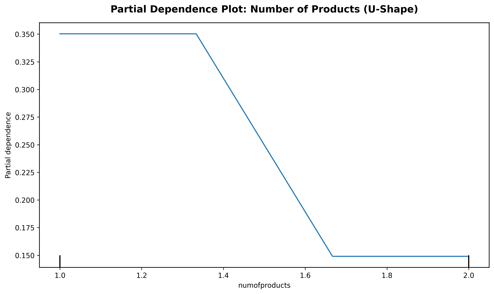

# Bank Customer Churn Analysis and Prediction

Customer attrition, also known as customer churn, is the loss of clients or customers. In banking, the cost of retaining an existing customer is far less than acquiring a new one. Banks often use customer attrition analysis and prediction models as key business metrics.

Predictive analytics use churn prediction models that assess customer propensity to churn by analyzing their characteristics and behaviors. Since these models generate prioritized lists of potential churners, they are effective at focusing retention efforts on customers most vulnerable to churn.

In this project, I perform customer survival analysis and build a model to predict bank customer churn using data from a [multinational bank dataset on Kaggle](https://www.kaggle.com/datasets/radheshyamkollipara/bank-customer-churn/data). I also demonstrate how to understand individual customer churn risk and calculate expected customer lifetime value. This project builds upon the excellent [survival analysis + ML methodology by Archit Desai](https://github.com/archd3sai/Customer-Survival-Analysis-and-Churn-Prediction), adapted for banking sector churn with enhanced analytical tools.

---

## Project Overview

This project analyzes **10,000 bank customers** with a baseline churn rate of **20.4%**. The analysis employs a three-stage methodology combining exploratory data analysis, survival analysis, and machine learning:

**Key Findings:**
- Complaint filing is the strongest churn predictor (99.5% of complainers churn)
- Product count exhibits extreme non-linearity: 2 products is optimal (7.6% churn) while 3-4 products leads to 82-100% churn
- Age shows strong lifecycle pattern with peak churn at ages 51-60 (56.2% churn rate)
- Inactive members churn at nearly twice the rate of active members (26.9% vs 14.3%)
- Germany market has twice the churn rate of France/Spain markets

**Final Model Performance:**
- F1 Score: 62.52%
- Accuracy: 85.85%
- Recall: 57.84% (correctly identifies 236 of 408 churners)
- ROC AUC: 85.85%

---

## Project Organization

```
bank_churn_project/
├── data/
│   ├── Customer-Churn-Records.csv
│   └── DATA_DICTIONARY.md
│
├── 01_exploratory_data_analysis/
│   ├── 01_eda.ipynb
│   ├── 01_eda.py
│   └── eda_utils.py
│
├── 02_survival_analysis/
│   ├── 02_survivalanalysis.ipynb
│   ├── 02_survivalanalysis.py
│   └── survival_utils.py
│
├── 03_churn_prediction/
│   ├── 03_churnprediction.ipynb
│   ├── 03_churnprediction.py
│   ├── modeling_utils.py
│   └── checkpoints/
│
├── executive_summary_assets/
│   └── (20 visualization PNG files)
│
├── generate_executive_plots.py
├── EXECUTIVE_SUMMARY.md
├── requirements.txt
└── README.md
```

---

## Customer Survival Analysis

**Survival Analysis:** Survival analysis is a set of methods for analyzing data where the outcome variable is the time until the occurrence of an event of interest. The event can be death, occurrence of a disease, customer churn, etc. The time to event can be measured in days, weeks, months, or years.

For example, if the event of interest is customer churn, then the survival time is the tenure (in months) until a customer churns.

**Objective:**
The objective of this analysis is to utilize non-parametric and semi-parametric methods of survival analysis to answer the following questions:
- How does the likelihood of customer churn change over time?
- How can we model the relationship between customer churn, time, and customer characteristics?
- What are the significant factors that drive customer churn?
- What is the survival and hazard curve of a specific customer?
- What is the expected lifetime value of a customer?

### Exploratory Data Analysis

Before survival analysis, I performed comprehensive EDA to understand feature distributions and relationships with churn:

<p align="center">


</p>

From the above analysis, we can conclude:
- The bank has a baseline churn rate of 20.4%, with 2,038 of 10,000 customers churning.
- Product count shows a dramatic U-shaped relationship: customers with 2 products have the lowest churn (7.6%), while customers with 3-4 products have catastrophic churn rates (82-100%).
- Age exhibits a clear lifecycle pattern. Younger customers (18-30) are highly loyal (7.5% churn), while customers aged 51-60 are at peak vulnerability (56.2% churn), likely due to retirement planning and account consolidation.
- The data suggests that over-selling products and failing to address lifecycle-driven needs are major churn drivers.

### Kaplan-Meier Survival Curve

<p align="center">

</p>

From the above graph, we can observe:
- The bank is able to retain more than 80% of its customers even after 10 months of tenure.
- There is a relatively constant decrease in survival probability between 0-8 months.
- After 8 months, the survival probability stabilizes, suggesting customers who stay beyond this period are more likely to remain long-term.

### Log-Rank Test

Log-rank test is carried out to analyze churning probabilities group-wise and to find if there is statistical significance between groups. The plots below show survival curves for different customer segments:

<p align="center">


</p>

From the above graphs, we can conclude:
- **Age groups show dramatic differences:** The 51-60 age group has significantly lower survival probability compared to younger customers. The 18-30 age group has the best retention.
- **Activity status is a strong differentiator:** Inactive members have consistently lower survival probability compared to active members throughout the entire customer tenure.
- If a customer is young and active, they are significantly less likely to churn. Conversely, customers aged 50+ who become inactive are at highest risk.

### Survival Regression

I use Cox Proportional Hazards model to perform survival regression on customer data. This model relates several risk factors simultaneously to survival time. In a Cox model, the measure of effect is the hazard ratio, which represents the risk of churning given specific customer characteristics.

<p align="center">

</p>

The model achieves a concordance index of 0.74 (good predictive power) and reveals:

| Feature | Hazard Ratio | Interpretation |
|---------|--------------|----------------|
| Age 51-60 | 7.94× | Customers aged 51-60 have nearly 8× the churn risk compared to young adults |
| Age 41-50 | 4.31× | Mid-life customers have 4× elevated risk |
| Germany | 1.60× | German customers have 60% higher churn risk than French customers |
| Female | 1.47× | Female customers have 47% higher churn risk than male customers |
| Active Member | 0.54× | Active members have 46% lower churn risk (protective factor) |

Using this model, we can calculate the survival curve and expected lifetime value of any individual customer based on their characteristics.

---

## Customer Churn Prediction

I aim to implement a machine learning model to accurately predict if a customer will churn.

### Modelling

For the modelling, I use a tree-based ensemble method as we do not have strong linearity in this classification problem. I also have class imbalance (20% churn vs 80% retention), so I assign a class weight of 2:1 to penalize false negatives more heavily. I built the model on 80% of the data and validated on the remaining 20%, while ensuring no data leakage.

The Random Forest model has many hyperparameters, and I tuned them using a 4-stage sequential grid search (73 combinations tested) while ensuring I did not overfit. The final model configuration:

```python
RandomForestClassifier(
    n_estimators=900,
    max_depth=11,              # Prevents overfitting
    criterion='gini',
    max_features=None,
    min_samples_split=4,
    min_samples_leaf=1,
    class_weight={0:1, 1:2},  # Addresses class imbalance
    random_state=42
)
```

The final model resulted in a **0.63 F1 score** and **0.86 ROC-AUC**, with significant improvement in recall (+21%) compared to baseline. The resulting plots can be seen below:

<p align="center">

</p>

<p align="center">

</p>

From the feature importance plot, we can see which features govern customer churn. Age, number of products, and activity status are the dominant predictors.

---

## Explainability

We can explain and understand the Random Forest model using explainable AI modules such as Permutation Importance, Partial Dependence Plots, and SHAP values.

**1. Permutation Importance** shows feature importance by randomly shuffling feature values and measuring how much it degrades model performance. This gives us the actual predictive power of each feature.

**2. Partial Dependence Plots** are used to see how churning probability changes across the range of a particular feature. For example, in the plot below for age, the churn probability increases dramatically after age 45.

<p align="center">


</p>

From the partial dependence plots we can observe:
- **Age**: Churn probability remains low and relatively flat until age 40, then begins to increase. After age 50, the probability increases sharply, peaking around ages 55-60.
- **Number of Products**: The plot shows a clear U-shape. Customers with 2 products have the lowest churn probability. Having only 1 product slightly increases risk, while having 3-4 products dramatically increases churn probability.

**3. SHAP values** (SHapley Additive exPlanations) is a game-theoretic approach to explain the output of any machine learning model. It shows why a particular customer's churning probability differs from the baseline and which features cause this difference.

<p align="center">

</p>

The SHAP summary plot shows:
- **Age** and **NumOfProducts** have the highest mean impact on model predictions
- Red points (high feature values) for age push predictions toward churn (positive SHAP)
- Blue points (low feature values) for number of products can both increase and decrease churn risk depending on whether the customer is under-engaged (1 product) or over-sold (3-4 products)
- **IsActiveMember** shows clear separation: inactive members (blue) consistently increase churn risk

### Individual Customer Example

Below is an example showing how SHAP explains an individual customer's churn probability:

**Customer Profile:**
- Age: 26 years
- Active Member: Yes  
- Balance: $166,257
- Products: 1
- Geography: Not Germany

**Model Prediction: 7.18% churn probability (Low Risk)**

**SHAP Breakdown:**
- Age (26): -0.145 (protective - young customers are loyal)
- Active membership: -0.054 (protective - engaged behavior)
- High balance: -0.037 (protective - financial commitment)
- Not Germany: -0.023 (protective - favorable market)
- Only 1 product: +0.020 (slight risk - under-engagement)

This customer is low risk due to youth, activity, and engagement. However, there's an opportunity to cross-sell to 2 products to optimize engagement without over-selling.

---

## Key Insights and Recommendations

Based on the analysis, the following interventions would be most effective at reducing churn:

1. **Stop Over-Selling Products**: Customers with 3-4 products have catastrophic churn rates (82-100%). The bank should cap cross-selling at 2 products per customer, which represents the optimal engagement level.

2. **Age 50+ Lifecycle Program**: The 51-60 age group has 8× higher churn risk. Proactive retirement planning outreach and specialized financial advisory services for this segment would address the root cause of lifecycle-driven churn.

3. **Re-Engage Inactive Members**: Inactive members churn at twice the rate of active members. Automated re-engagement campaigns (email, SMS, incentives) targeting customers who haven't transacted in 60+ days would reduce preventable churn.

4. **Investigate Germany Market**: Germany has twice the churn rate of France/Spain. Root cause analysis (customer surveys, competitive analysis, service quality audit) is needed to identify and fix market-specific issues.

5. **Complaint Prevention System**: 99.5% of customers who file complaints churn. Focus on proactive issue resolution and service quality improvements to prevent complaints rather than attempting to resolve them after filing.

---

## Methodological Enhancements

This project extends the survival analysis + ML methodology with several technical improvements:

1. **Modular Code Architecture** - Standardized utility functions across all analysis stages (eda_utils.py, survival_utils.py, modeling_utils.py)
2. **Checkpointing System** - Saves expensive computations (grid searches, SHAP) for fast reruns and reproducibility
3. **Feature Categorization Framework** - Systematic grouping and aggressive feature selection based on statistical evidence
4. **Custom Survival Visualizations** - Professional at-risk tables with color-coding and proper formatting
5. **Cox PH Multicollinearity Handling** - Addressed dummy variable trap and dominant feature exclusion
6. **4-Stage Sequential Grid Search** - 73 hyperparameter combinations tested with class weight optimization
7. **3-Method Feature Validation** - Built-in importance + Permutation + SHAP for robust interpretation
8. **Automated Reporting Pipeline** - Plot generation script for reproducible executive summaries
9. **Business-Focused Documentation** - 40-50 page executive summary with ROI projections and implementation roadmap

---

## Requirements

```bash
# Python 3.11+
pandas==2.2.2
numpy==1.26.4
matplotlib==3.9.2
seaborn==0.13.2
scikit-learn==1.5.2
lifelines==0.29.0
shap==0.46.0
jupyter==1.0.0
```

**Install:**
```bash
pip install -r requirements.txt
```

---

## How to Run This Project

### 1. Exploratory Data Analysis
```bash
cd 01_exploratory_data_analysis
jupyter nbconvert --to notebook --execute 00_eda.py
# Or open 00_eda.py in Jupyter/VS Code with Jupyter extension
```

### 2. Survival Analysis
```bash
cd 02_survival_analysis
jupyter notebook 02_survivalanalysis.ipynb
# Or convert and run 01_survivalanalysis.py
```

### 3. Churn Prediction
```bash
cd 03_churn_prediction
jupyter nbconvert --to notebook --execute 03_churnprediction.py
# Checkpoints will be saved/loaded automatically
```

### 4. Generate Executive Summary Plots
```bash
python generate_executive_plots.py --section all
# Or run specific sections: --section eda|survival|prediction
```


---

## Dataset

**Source:** [Bank Customer Churn Dataset on Kaggle](https://www.kaggle.com/datasets/radheshyamkollipara/bank-customer-churn/data)  
**Author:** Radheshyam Kollipara  
**Coverage:** March 31, 2022 - April 30, 2022  
**Geographic Scope:** Global (multinational bank)

The dataset contains 10,000 customer records from an anonymous multinational bank, with 18 features including:
- **Demographics:** Age, Gender, Geography (France, Spain, Germany)
- **Account Information:** Credit Score, Balance, Estimated Salary, Tenure
- **Product Usage:** Number of Products, Credit Card ownership, Card Type
- **Behavioral Indicators:** Active Member status, Points Earned
- **Customer Experience:** Complaint status, Satisfaction Score
- **Target Variable:** Exited (whether the customer churned)

As we know, it is much more expensive to sign in a new client than keeping an existing one. It is advantageous for banks to know what leads a client towards the decision to leave the company. Churn prevention allows companies to develop loyalty programs and retention campaigns to keep as many customers as possible.

---

## Acknowledgments

This project was inspired by and builds upon the excellent work of [**Archit Desai**](https://github.com/archd3sai/Customer-Survival-Analysis-and-Churn-Prediction). The original repository provided the foundational methodology for combining survival analysis with machine learning for churn prediction. 

While the original project focused on telecom customer churn, this implementation explores banking sector churn with enhanced analytical tools and reproducible workflows.

---

## License

MIT License

